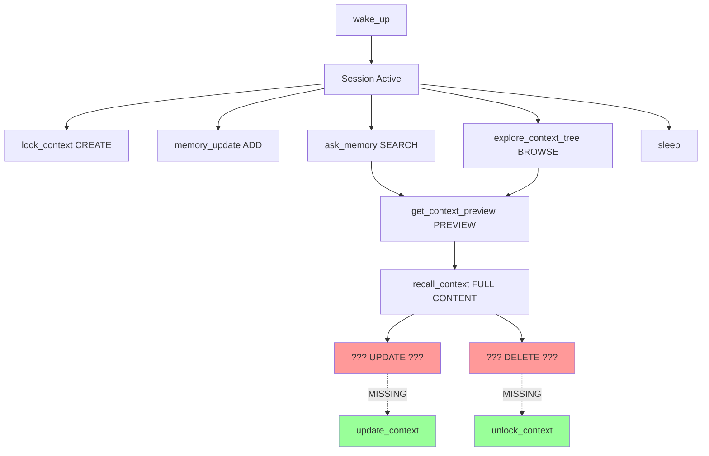

# Tool Audit & CRUD Analysis

## Current Tool Inventory (18 tools)

### Session Management (2 tools)
1. **wake_up()** - Start session, load reminders
2. **sleep()** - End session, create handover

**Purpose**: Session lifecycle management
**Fluency**: ✅ Clear start/end flow

---

### Ephemeral Memory (2 tools)
3. **memory_update(category, content)** - Add memory entry
4. **memory_status()** - View memory statistics

**Purpose**: Short-term, categorized notes
**Fluency**: ✅ Add and view, but no delete/update
**Gap**: No way to remove outdated memory entries

---

### Locked Context - READ Operations (6 tools! ⚠️)
5. **recall_context(topic, version)** - Get full content by exact topic
6. **list_topics()** - List all topic names with versions
7. **check_contexts(text)** - Find relevant contexts for text
8. **ask_memory(question)** - Natural language search (Phase 5)
9. **get_context_preview(topic)** - Lightweight preview (Phase 5)
10. **explore_context_tree()** - Browse all contexts grouped by priority (Phase 5)

**Purpose**: Multiple ways to READ locked contexts
**Fluency**: ⚠️ Too many similar tools - redundancy
**Analysis**:
- `recall_context()` - Exact topic, full content
- `list_topics()` - See what exists (names only)
- `check_contexts()` - Relevance-based search
- `ask_memory()` - Natural language search (NEW, better than check_contexts)
- `get_context_preview()` - Quick preview (NEW, lighter than recall)
- `explore_context_tree()` - Browse all (NEW, better than list_topics)

**Recommendation**:
- ✅ Keep: `recall_context()`, `ask_memory()`, `get_context_preview()`, `explore_context_tree()`
- ❓ Deprecate: `list_topics()` (replaced by `explore_context_tree()`)
- ❓ Deprecate: `check_contexts()` (replaced by `ask_memory()`)

---

### Locked Context - CREATE/UPDATE/DELETE (⚠️ CRITICAL GAPS)
11. **lock_context(content, topic, tags, priority)** - CREATE locked context

**CRUD Analysis**:
- ✅ **C**REATE: `lock_context()` exists
- ✅ **R**EAD: 6 tools (too many!)
- ❌ **U**PDATE: **MISSING** - No way to update locked context!
- ❌ **D**ELETE: **MISSING** - No way to remove outdated/irrelevant contexts!

**Critical Gaps**:
1. **No update_context()** - Can't fix typos or update locked info
2. **No unlock_context()** - Can't remove outdated contexts
3. Contexts accumulate forever, polluting search results

---

### Project File Scanning (7 tools)
12. **project_update()** - Scan project, tag files
13. **project_status()** - View project statistics
14. **tag_path(path, tags, comment)** - Tag specific file
15. **search_by_tags(query)** - Search files by tag query
16. **file_insights(path)** - Get insights about file
17. **get_tags(path)** - Get tags for specific file
18. **search_tags(tag)** - Find files with specific tag

**Purpose**: Semantic file organization
**Fluency**: ⚠️ Some redundancy
- `search_by_tags()` vs `search_tags()` - Similar but different query types
- `file_insights()` vs `get_tags()` - Could be consolidated

---

## Tool Fluency Map



## Critical Gaps & Recommendations

### 🔴 Priority 1: Complete CRUD for Locked Contexts

**Missing Operations**:

1. **UPDATE** - `update_context(topic, content, version='latest', tags=None, priority=None)`
   ```python
   # Use case: Fix typo in locked API spec
   update_context(
       topic="api_auth_rules",
       content="UPDATED: Use OAuth 2.0 with PKCE...",
       version="latest"  # Creates v1.1 (keeps v1.0 for history)
   )
   ```

2. **DELETE** - `unlock_context(topic, version='all')`
   ```python
   # Use case: Remove outdated deployment process
   unlock_context("old_deployment_process")

   # Use case: Remove specific version
   unlock_context("api_spec", version="1.0")
   ```

**Why Critical**:
- ❌ Can't fix mistakes in locked contexts
- ❌ Can't remove outdated information
- ❌ Contexts pollute search results forever
- ❌ No way to maintain clean context tree

---

### 🟡 Priority 2: Reduce READ Tool Redundancy

**Phase 5 tools supersede older tools**:

1. `explore_context_tree()` > `list_topics()`
   - Tree view better than flat list
   - Shows previews, not just names
   - Groups by priority

2. `ask_memory()` > `check_contexts()`
   - Natural language vs exact text matching
   - Better relevance scoring
   - Clearer output format

**Recommendation**: Deprecate `list_topics()` and `check_contexts()`
- Mark as deprecated in descriptions
- Suggest replacements
- Remove in v5.0

---

### 🟢 Priority 3: Consolidate File Tools (Optional)

**Consider merging**:
- `file_insights()` + `get_tags()` → Single tool with `detail_level` param
- `search_tags()` + `search_by_tags()` → Unified search with query type detection

---

## Proposed New Tools

### 1. update_context()
```python
@mcp.tool()
async def update_context(
    topic: str,
    content: str,
    version: str = "latest",
    tags: Optional[str] = None,
    priority: Optional[str] = None,
    reason: Optional[str] = None
) -> str:
    """
    Update an existing locked context with new content.

    Creates a new version while keeping old versions for history.
    Use this to fix typos, add details, or update outdated information.

    **When to use:**
    - Fix typos in locked contexts
    - Update API specs with new endpoints
    - Revise rules or decisions
    - Add missing information

    **Versioning:**
    - Updates v1.0 → creates v1.1 (keeps v1.0)
    - Maintains version history for rollback

    Returns: New version number and change summary
    """
```

### 2. unlock_context()
```python
@mcp.tool()
async def unlock_context(
    topic: str,
    version: str = "all",
    reason: Optional[str] = None
) -> str:
    """
    Remove locked context(s) that are no longer relevant.

    Use this to clean up outdated information and keep context tree lean.

    **When to use:**
    - Remove outdated deployment processes
    - Delete deprecated API specs
    - Clean up test/experimental locks
    - Remove duplicates

    **Safety:**
    - Requires explicit confirmation for always_check priority
    - Archives deleted contexts for recovery
    - Shows what will be deleted before confirmation

    **Examples:**
    ```
    unlock_context("old_api_v1")           # Remove all versions
    unlock_context("api_spec", "1.0")      # Remove specific version
    unlock_context("test_*")               # Bulk remove (with confirmation)
    ```

    Returns: Count of deleted contexts and archive location
    """
```

### 3. archive_context() (Optional)
```python
@mcp.tool()
async def archive_context(topic: str, version: str = "latest") -> str:
    """
    Archive context (hide from search but keep for history).

    Safer than delete - context still exists but won't appear in searches.

    Returns: Confirmation and how to unarchive
    """
```

---

## Tool Count Summary

**Current**: 18 tools
**After adding CRUD**: 20 tools (+2: update_context, unlock_context)
**After deprecation**: 18 tools (-2: list_topics, check_contexts)

**Net**: 18 tools (same count, better coverage)

---

## Implementation Priority

### Phase 6A: CRUD Completion (2-3 hours)
1. ✅ Design update_context() - versioning logic
2. ✅ Implement update_context() - creates new version
3. ✅ Design unlock_context() - safety checks
4. ✅ Implement unlock_context() - with archive
5. ✅ Test CRUD operations together
6. ✅ Update tool descriptions to mention UPDATE/DELETE

### Phase 6B: Deprecation (1 hour)
1. Mark list_topics() as deprecated
2. Mark check_contexts() as deprecated
3. Update descriptions to suggest replacements
4. Add migration guide to CLAUDE.md

### Phase 6C: Documentation (1 hour)
1. Update CLAUDE.md with CRUD workflow
2. Add examples of UPDATE/DELETE usage
3. Document version history pattern
4. Create cleanup best practices

---

## User's Question: "Do we have CRUD?"

**Answer**:
- ✅ CREATE: Yes (`lock_context`)
- ✅ READ: Yes (6 tools - too many, but functional)
- ❌ UPDATE: **No - critical gap**
- ❌ DELETE: **No - critical gap**

**Impact**: Can't remove irrelevant items or fix mistakes in locked contexts.

**Solution**: Implement `update_context()` and `unlock_context()` (Phase 6A)
