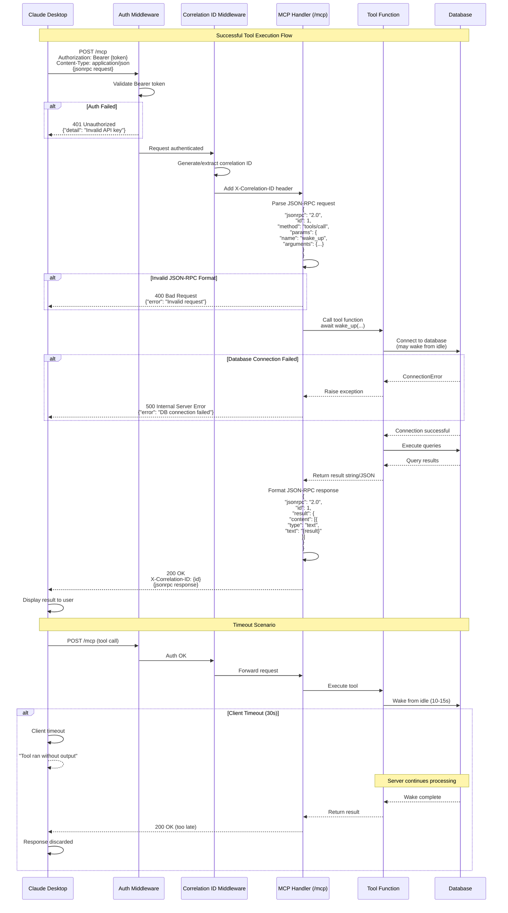
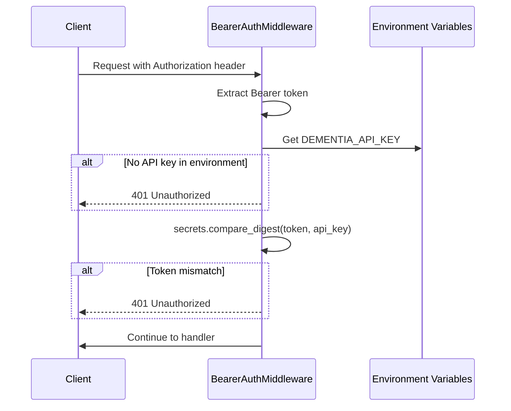
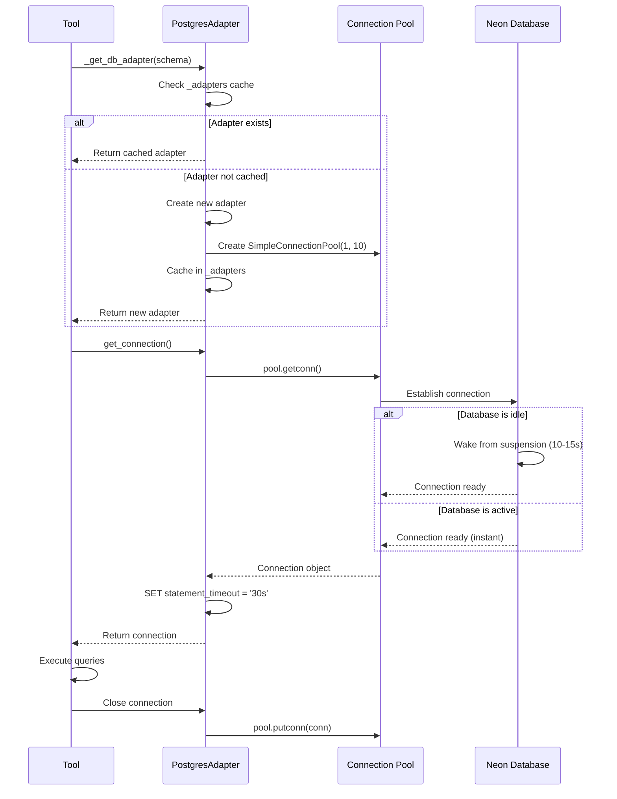

# MCP Cloud-Hosted Protocol Documentation

## Overview

This document describes the expected protocol flow for cloud-hosted MCP servers accessed by Claude Desktop via HTTP transport.

## Architecture

```
Claude Desktop → HTTP Client → Cloud MCP Server → Database
                    ↓                ↓
               (Bearer Auth)   (Tool Execution)
```

## Complete Request/Response Flow



## Request Format (JSON-RPC 2.0)

### Tool Call Request
```json
{
  "jsonrpc": "2.0",
  "id": 1,
  "method": "tools/call",
  "params": {
    "name": "wake_up",
    "arguments": {
      "project": "claude_dementia"
    }
  }
}
```

### Headers Required
```http
POST /mcp HTTP/1.1
Host: dementia-mcp-server-x8fkw.ondigitalocean.app
Authorization: Bearer {DEMENTIA_API_KEY}
Content-Type: application/json
X-Correlation-ID: req-1730727043123 (optional)
```

## Response Format (JSON-RPC 2.0)

### Success Response
```json
{
  "jsonrpc": "2.0",
  "id": 1,
  "result": {
    "content": [
      {
        "type": "text",
        "text": "{\"session_id\": \"abc123\", \"status\": \"ok\"}"
      }
    ]
  }
}
```

### Error Response (Application Error)
```json
{
  "jsonrpc": "2.0",
  "id": 1,
  "error": {
    "code": -32603,
    "message": "Internal error",
    "data": {
      "detail": "Database connection failed"
    }
  }
}
```

### HTTP Error Responses

#### 400 Bad Request
- Malformed JSON-RPC request
- Missing required fields
- Invalid method name
- Invalid tool name

#### 401 Unauthorized
- Missing Authorization header
- Invalid Bearer token
- Expired credentials

#### 500 Internal Server Error
- Tool execution exception
- Database connection failure
- Unexpected server error

## Timeout Behavior

### Claude Desktop Client Timeouts
- **Default**: ~30 seconds for tool execution
- **Behavior**: If no response received, shows "Tool ran without output or errors"
- **Recovery**: Client abandons request, server may still be processing

### Server-Side Timeouts
- **Database statement timeout**: 30 seconds (postgres_adapter.py)
- **HTTP request timeout**: No explicit timeout (relies on Uvicorn/Starlette defaults)
- **Database wake time**: 10-15 seconds for Neon cold start

### Recommended Timeout Handling

1. **Client-side**: Increase timeout for slow operations
2. **Server-side**: Add request timeout middleware
3. **Database**: Optimize for faster wake (connection pooling)
4. **Tool-level**: Add progress callbacks for long operations

## Authentication Flow



## Database Connection Flow



## Current Issues Identified

### Issue 1: 400 Bad Request on Tool Calls
**Symptom**: `POST /mcp HTTP/1.1" 400 Bad Request`
- Requests fail before reaching tool execution
- No logs showing tool invocation
- Happens with both `sleep` and `wake_up`

**Possible Causes**:
1. Invalid JSON-RPC format from client
2. Missing required MCP protocol fields
3. Unsupported method name
4. FastMCP protocol version mismatch

**Investigation Needed**:
- [ ] Enable request body logging in server_hosted.py
- [ ] Verify Claude Desktop sends valid JSON-RPC 2.0 format
- [ ] Check FastMCP's expected request structure
- [ ] Add error logging before 400 response

### Issue 2: 30+ Second Timeout with No Output
**Symptom**: Tools return "Tool ran without output or errors"
- Client waits 30+ seconds
- No response received
- Database remains idle (no wake event)

**Possible Causes**:
1. Request rejected at HTTP layer (400) before reaching tool
2. Tool executes but response format invalid
3. Client timeout shorter than database wake time
4. Response lost during transmission

**Investigation Needed**:
- [ ] Add request/response logging middleware
- [ ] Measure actual database wake time
- [ ] Test with curl to isolate client vs server
- [ ] Add timeout middleware to detect slow requests

## Testing Protocol Compliance

### Manual Test with curl

```bash
# Test authentication
curl -X POST https://dementia-mcp-server-x8fkw.ondigitalocean.app/mcp \
  -H "Authorization: Bearer ${DEMENTIA_API_KEY}" \
  -H "Content-Type: application/json" \
  -d '{
    "jsonrpc": "2.0",
    "id": 1,
    "method": "tools/call",
    "params": {
      "name": "wake_up",
      "arguments": {"project": "claude_dementia"}
    }
  }'

# Test without auth (should get 401)
curl -X POST https://dementia-mcp-server-x8fkw.ondigitalocean.app/mcp \
  -H "Content-Type: application/json" \
  -d '{
    "jsonrpc": "2.0",
    "id": 1,
    "method": "tools/call",
    "params": {
      "name": "wake_up",
      "arguments": {"project": "claude_dementia"}
    }
  }'

# Test invalid JSON-RPC (should get 400)
curl -X POST https://dementia-mcp-server-x8fkw.ondigitalocean.app/mcp \
  -H "Authorization: Bearer ${DEMENTIA_API_KEY}" \
  -H "Content-Type: application/json" \
  -d '{
    "invalid": "request"
  }'
```

### Expected Responses

**Valid Request**:
```json
{
  "jsonrpc": "2.0",
  "id": 1,
  "result": {
    "content": [{"type": "text", "text": "..."}]
  }
}
```

**Invalid Auth**:
```json
{
  "detail": "Invalid API key"
}
```

**Invalid Request**:
```json
{
  "jsonrpc": "2.0",
  "id": null,
  "error": {
    "code": -32600,
    "message": "Invalid Request"
  }
}
```

## Recommendations

### 1. Add Request Logging Middleware
```python
class RequestLoggingMiddleware(BaseHTTPMiddleware):
    async def dispatch(self, request, call_next):
        if request.url.path.startswith('/mcp'):
            body = await request.body()
            logger.debug("mcp_request_received",
                        path=request.url.path,
                        method=request.method,
                        headers=dict(request.headers),
                        body=body.decode('utf-8'))

        response = await call_next(request)
        return response
```

### 2. Add Timeout Middleware
```python
class TimeoutMiddleware(BaseHTTPMiddleware):
    async def dispatch(self, request, call_next):
        start_time = time.time()
        try:
            response = await asyncio.wait_for(
                call_next(request),
                timeout=45.0  # 45s server timeout
            )
            return response
        except asyncio.TimeoutError:
            elapsed = time.time() - start_time
            logger.error("request_timeout",
                        path=request.url.path,
                        elapsed_seconds=elapsed)
            return JSONResponse(
                status_code=504,
                content={"error": "Request timeout"}
            )
```

### 3. Improve Error Logging in FastMCP Handler
- Log raw request body before parsing
- Log parsing errors with details
- Log tool execution start/end
- Log response before sending

### 4. Test Database Wake Performance
```python
# Add timing to wake_up tool
start = time.time()
conn = _get_db_for_project(project)
wake_time = time.time() - start
logger.info("database_wake_time", seconds=wake_time)
```

## Next Steps

1. Add request logging middleware to capture 400 errors
2. Test with curl to verify MCP protocol compliance
3. Measure database wake time under cold start
4. Add timeout middleware for long operations
5. Document findings and update this file
